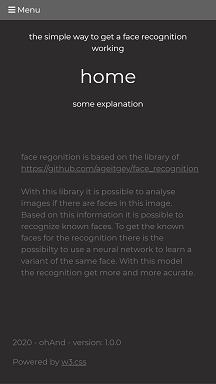
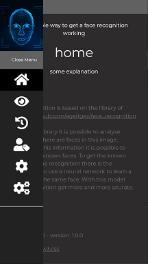
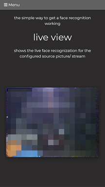
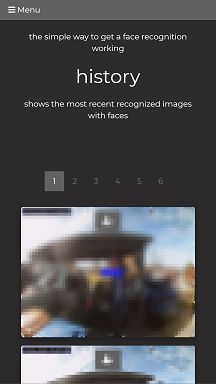
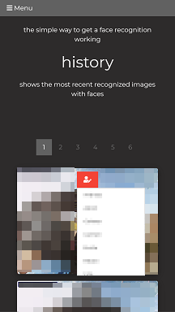
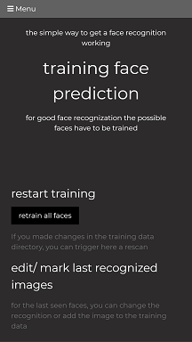
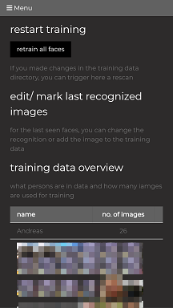
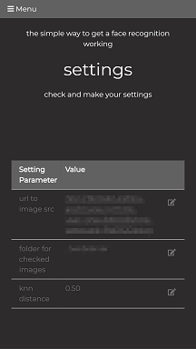
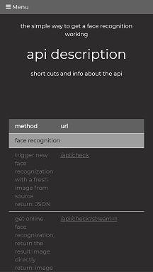

# faceRecogDaemon


- [faceRecogDaemon](#facerecogdaemon)
  - [description](#description)
    - [Problem](#problem)
    - [Possible solution](#possible-solution)
    - [Features](#features)
      - [user side](#user-side)
      - [technical side](#technical-side)
  - [installation](#installation)
    - [download & start](#download--start)
    - [configuration](#configuration)
  - [API](#api)
    - [face recognition](#face-recognition)
      - [/api/check](#apicheck)
      - [/api/check?stream=1](#apicheckstream1)
    - [training](#training)
      - [/api/training?getdata=true](#apitraininggetdatatrue)
      - [/api/training?retrain=true](#apitrainingretraintrue)
      - [/api/training?rename=true&image=mmmmm.jpg&name=Joe](#apitrainingrenametrueimagemmmmmjpgnamejoe)
      - [/api/get_train_image?person=name&filename=name01.png](#apigettrainimagepersonnamefilenamename01png)
      - [/api/get_train_image?person=name&number=0](#apigettrainimagepersonnamenumber0)
    - [recent recognitions](#recent-recognitions)
      - [/api/get_recent_image](#apigetrecentimage)
      - [/api/get_recent_image?json](#apigetrecentimagejson)
      - [/api/get_recent_image?json&limit=30](#apigetrecentimagejsonlimit30)
      - [/api/get_recent_image?number=0](#apigetrecentimagenumber0)
      - [/api/get_recent_image?filename=name](#apigetrecentimagefilenamename)
      - [/api/get_recent_image?number=0&original=true](#apigetrecentimagenumber0originaltrue)
    - [images](#images)
      - [/api/get_image?file=name](#apigetimagefilename)
  - [Links](#links)

## description
Just started as a little application for easy managing face recognition outputs.

### Problem

You have a video/ image stream of a camera or something else. And you want to analyse the images for known faces. And get needed infos for further triggering for e.g. a smart home system to open a door or similar things.

### Possible solution

face recognition daamon ;-)

### Features

#### user side
- bind with image streams or NEW with rtsp stream, see config
- overview of recent historic recognized faces
  - change seen faces to other persons for next training
  - change seen faces to new persons for next training (coming soon)
- manage training data
  - remove images from person folder
  - move images to other persons
- manage settings (editing - coming soon)
- show api information

screenshots of client:











#### technical side
- for the recognition itself the library of https://github.com/ageitgey/face_recognition is used 
- api for all stuff provided
- client in hmtl/ javascript full responsive and prepared for web app
- 3-tier architecture - file-db, backend/ middleware, client ( not fully at this time ;-) )
  - "file-db" - primitve folder driven training data for images + archive for recognized faces
  - backend/ middleware - serves the functions over an api
  - client - html/ javascript web client prepared for a web app


## installation
The application is written in Python. So you need an already installed environment as described here: https://www.python.org/about/gettingstarted/ - needed version >= 3.6

If you running an ubuntu maybe you need for compiling dlib (only one time)

        sudo apt install python3.7-dev


### download & start

Donwload 'face recognition daemon' application the last release at https://github.com/ohAnd/faceRecogDaemon/releases

Update pip to the latest

        python -m pip3 install --upgrade pip

during the installation [dlib](dlib.net) will be installed (need's some time for compiling ;-) )

intall needed modules

        pip3 install -r requirements.txt

for quick start:
- create a path for known faces outside the app directory e.g. /path/to/knownFaces and put the path to config see below
  - inside this path create a dirextory for each person you want to recognize
  - in this subfolders you have to put some images for training
  - images must have only **one** face showing, otherwise it it will be ignored by training
    ```
      Structure:
            </path/to/knownFaces>/
            |-- <person1>/
            |   |-- <somename1>.jpeg
            |   |-- <somename2>.png
            |   |-- ...
            |-- <person2>/
            |   |-- <somename1>.jpeg
            |   |-- <somename2>.jpeg
            |-- ...
    ```
- create a archive path outside the app directory e.g. /path/to/imageArchive and put the path to config see below

start the server (service installation coming soon)

        bash://<paht/to/your/download>> ./faecRecogDaemon.py

### configuration
create a config file in application root directory

        touch config.ini

with following content

        # config file for face recog daemon
        [webserver]
        Port: 5001

        [imageSource]
        urlToImageSrc = <your_path_to_image_src> # e.g. http://<urlTocam>:port/image.cgi
        // urlToImageSrc = <your_path_to_image_src> # e.g. rtsp://user:pass@<ip-address>:<port>/media.amp

        [faceRecognition]
        knnDistance = 0.50

        [directories]
        pathToKnownFaces = <your_path>
        pathToImageArchive = <your_path>

___
___
## API
___
### face recognition 

#### /api/check
trigger new face recognization with a fresh image from source<br> return: JSON

<details>
<summary>response</summary>
with response code 200, following json will be returned

```json
{
  "checkDetails": {
    "NumberOfFaces": 0, 
    "imageToCheck": "http://<source image>", 
    "linkToArchivedImage": ""
  }, 
  "checkResults": {
    "linkToResultImage": "http://<host of face recog daemon>/api/get_image?file=/noFaces/<archived image name>.jpg", 
    "personsFound": {}
  }, 
  "status": "no faces found"
}
```

</details>

#### /api/check?stream=1
get online face recognization, return the result image directly<br> return: image
___
### training

#### /api/training?getdata=true
get all training src data as summary in JSON

<details>
<summary>response</summary>
with response code 200, following json will be returned

```json
{
  "persons": {
    "<nameOfPerson1>": {
      "count": 26, 
      "imagelinks": [
        "<baseImage>.png", 
        ...
        "<baseImage_n_>.jpg", 
        "<baseImage_m_>.jpg"
      ]
    }, 
    "<nameOfPerson2>": {
      "count": 10, 
      "imagelinks": [
        "<baseImage>.png", 
        ...
        "<baseImage_n_>.jpg", 
        "<baseImage_m_>.jpg"
      ]
    }
  }
}

```

</details>

#### /api/training?retrain=true
retrigger the training of given images

#### /api/training?rename=true&image=mmmmm.jpg&name=Joe
move image from history to training data with given person name

#### /api/get_train_image?person=name&filename=name01.png
get trained image by person and filename

#### /api/get_train_image?person=name&number=0
get trained image by number
___
### recent recognitions
#### /api/get_recent_image
get most recent image

#### /api/get_recent_image?json
get an overview of recent images in JSON<br>(default limited to 10, if less images available it is shortend)

#### /api/get_recent_image?json&limit=30
get an overview of recent images in JSON with given limit of resopnse<br>e.g. 30 entries (hard limited to 1000)

#### /api/get_recent_image?number=0
get most recent image - higher number means older image

#### /api/get_recent_image?filename=name
get most recent image with new face recognition fpr filename

#### /api/get_recent_image?number=0&original=true
get most recent image without image manipulation (timestamp face frame/ naming)
___
### images
#### /api/get_image?file=name
get image file with name

___                


## Links
source for used libs:
- https://github.com/ageitgey/face_recognition
- https://github.com/ageitgey/face_recognition/blob/master/examples/face_recognition_svm.py
- https://face-recognition.readthedocs.io/en/latest/face_recognition.html

used images:
- https://www.freepik.com/premium-vector/biometric-person-identification-facial-recognition-concept-futuristic-low-polygonal-human-face_4847694.htm
- ...


